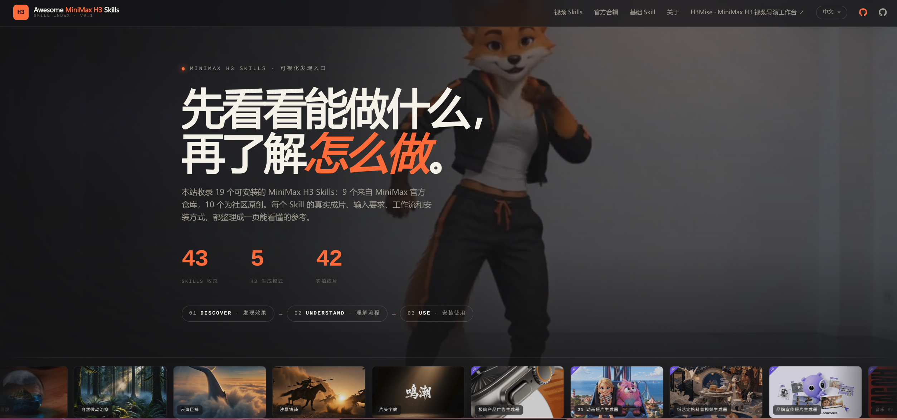

# Awesome MiniMax H3 Skills

[](LICENSE)
[](https://h3skills.com)
[](https://github.com/gordonlu/awesome-minimax-h3-skills)

[中文](README.md)

A visual discovery and reference site for MiniMax H3 skills, prompts, and generated examples.

> Independent community project — not an official MiniMax website.



## Online

- Main: **https://h3skills.com**
- Fallback: https://awesome-minimax-h3-skills.pages.dev

## What's included

- **43 Skills** — 9 official + 34 community skills, each with real output videos, input requirements, workflow, and one-click install
- **49 prompts** — curated from the official MiniMax H3 handbook, organized into 10 categories with one-click copy
- **6 languages** — Chinese / English / Korean / German / Japanese / Spanish
- **SEO** — per-skill meta, Open Graph, VideoObject structured data, bilingual snapshots
- **License compliance** — `/license` page with MiniMax H3 Community License info, AI-generated badges on videos

## Run

Pure static site, no build step required:

```bash
python3 -m http.server 8000
# open http://localhost:8000
```

## What's inside

```
├── index.html              # SPA entry (MIT)
├── src/                    # original frontend code (MIT)
│   ├── app.js              # routing · rendering · GSAP animations · Fuse.js search
│   ├── styles.css          # design system
│   └── vendor/             # GSAP, © GreenSock
├── data/                   # manually curated skill data (MIT)
│   ├── skills.js           # 43 skill metadata entries
│   ├── anthology.js        # official prompt anthology
│   ├── i18n.js             # 6-language UI translations
│   └── locales/            # skill text translations
├── community-skills/       # community skill source files + assets
├── scripts/                # build tooling
│   ├── prerender.sh        # Chrome snapshot + SEO post-processing
│   ├── generate_sitemaps.py
│   └── generate_atom.py
├── skill/<slug>/           # pre-rendered Chinese detail pages
├── en/                     # pre-rendered English snapshots
├── og/                     # social share images (1200×630)
├── third_party/
│   └── MiniMax-H3/         # official demo media, © MiniMax
├── /license                # License & Attribution page
├── /faq                    # FAQ
├── /prompts                # prompt landing page
├── sitemap.xml
├── atom.xml
├── LICENSE                 # MIT — original code only
└── _redirects              # Cloudflare Pages routing
```

## Licensing

MiniMax H3, official H3 Skills, and related media assets are © MiniMax and
remain subject to their original license terms (MiniMax H3 Community License
Agreement — see [LICENSE](https://huggingface.co/MiniMaxAI/MiniMax-H3/blob/main/LICENSE)).
This project's original source code is licensed under MIT.

Third-party community materials retain their original authorship and source attribution.

## Disclaimer

H3Skills is not an official MiniMax website. The "Official" mark means a skill
ships in the MiniMax-AI/MiniMax-H3 repository — it does not mean this site is
run by MiniMax.

The prompt anthology page reuses example images from the official MiniMax H3
handbook for learning and showcase purposes.

## Credits

- Skills & demo media: https://github.com/MiniMax-AI/MiniMax-H3
- MiniMax H3 model: https://huggingface.co/MiniMaxAI/MiniMax-H3
- MiniMax H3 video directing workstation: https://github.com/gordonlu/h3mise
- Animation: GSAP — https://gsap.com
