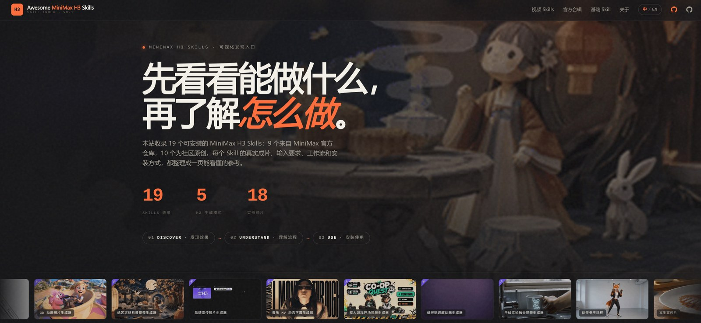

# Awesome MiniMax H3 Skills

[](LICENSE)
[](https://h3skills.com)
[](https://github.com/gordonlu/awesome-minimax-h3-skills)

MiniMax H3 官方 Skills 的可视化发现与参考站点 · A visual discovery and
reference site for the official MiniMax H3 Skills.

**先看到效果，再理解做法。See what it makes — then learn how it's made.**

> Independent community project — not an official MiniMax website.
> 独立社区项目，并非 MiniMax 官方网站。



## Online / 在线访问

- Main: **https://h3skills.com**
- Fallback: https://awesome-minimax-h3-skills.pages.dev

## Run / 运行

Pure static site, no build step. Any static server works:

```bash
# from the project root
python3 -m http.server 8000
# open http://localhost:8000
```

## What's inside / 目录结构

```
├── index.html              # site entry (MIT)
├── src/                    # original source code (MIT)
│   ├── app.js
│   ├── styles.css
│   └── vendor/             # GSAP, © GreenSock — see NOTICE
├── data/                   # manually curated skill summaries (MIT)
│   └── skills.js
├── third_party/
│   └── MiniMax-H3/         # official demo media, © MiniMax
│       ├── LICENSE         # MiniMax H3 Community License Agreement (copy)
│       ├── README.md       # provenance & modification notes
│       └── previews/       # re-encoded from official GIFs (marked as modified)
├── LICENSE                 # MIT — this project's original code only
└── NOTICE                  # required third-party notices
```

## Licensing / 许可说明

MiniMax H3, official H3 Skills, and related media assets are © MiniMax and
remain subject to their original license terms (MiniMax H3 Community License
Agreement — see `third_party/MiniMax-H3/LICENSE`). This project's original
source code is licensed under MIT.

MiniMax H3、官方 H3 Skills 及相关媒体素材版权归 MiniMax 所有，仍受其原始
协议约束（见 `third_party/MiniMax-H3/LICENSE`）。本项目原创代码以 MIT
协议发布。

Third-party community materials (e.g. third-party Community Skills and their
demo media) retain their original authorship and source attribution; repository
licenses apply only to content authored by this project unless otherwise stated.

第三方社区材料（如第三方 Community Skills 及其演示素材）保留原作者署名与来源
标注；本仓库许可证仅适用于本项目原创内容，另有声明除外。

Every skill page marks its origin as:
**Official MiniMax H3 Skill · Source: MiniMax-AI/MiniMax-H3**

## Disclaimer / 免责声明

The prompt gallery page reuses example images from the official MiniMax H3
handbook for learning and showcase purposes. Brand marks appearing inside
those examples belong to their respective owners; this project has no
affiliation, endorsement, or agency with them.

合辑页的示例图片来自 MiniMax H3 官方《使用手册》，仅用于学习与展示。其中
出现的品牌标识归其各自所有者所有，本项目与其无任何关联、授权或代言关系。

## Credits / 数据来源

- Skills & demo media: https://github.com/MiniMax-AI/MiniMax-H3
- MiniMax H3 model: https://huggingface.co/MiniMaxAI/MiniMax-H3
- Animation: GSAP — https://gsap.com
