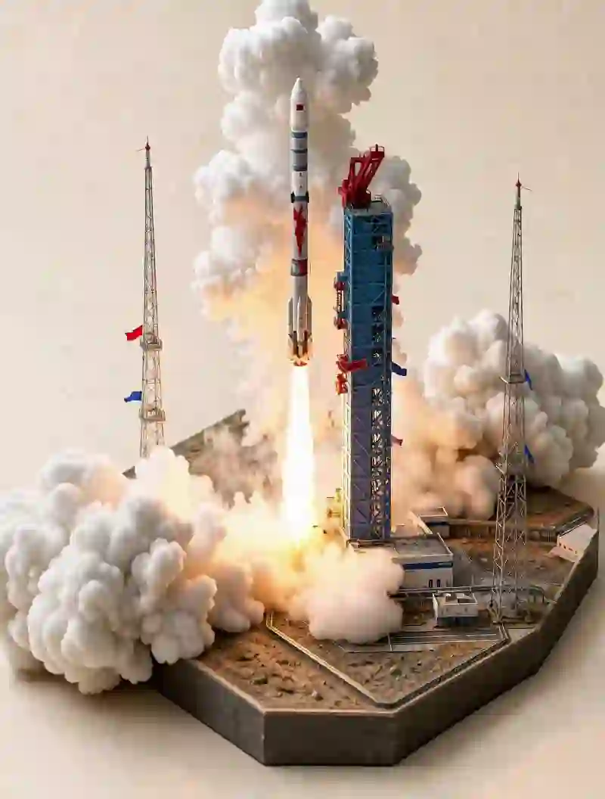

# 微缩火箭发射场

从单张参考图生成 10 秒微缩火箭发射场发射视频。

## 功能说明

完整保留参考图中的火箭设计、发射塔、红色服务结构、桁架塔、支撑建筑、道路、沙地、方形模型底座、温暖象牙色工作室背景、比例关系、材质和手工建筑模型外观。摄像机全程保持固定，采用俯视 3/4 等距构图。

## 动画时间线

- **0–3 秒**：火箭在发射塔旁缓慢垂直升空，明亮的橙白色火焰从引擎向下喷射。浓密的白色烟雾迅速围绕发射台扩散。
- **3–7 秒**：火箭继续攀升超过发射塔。尾焰变得更长更有力。浓烟在发射综合体底部自然扩散，流过建筑物。
- **7–10 秒**：火箭到达画面上方。明亮的尾迹向下延伸至发射台。地面烟雾继续翻滚并缓慢扩散。

## 次要运动

小旗帜因尾气扰动轻轻飘动，发射台附近的细小灰尘被向外推开，烟雾自然卷绕发射结构，引擎光在附近金属表面产生微弱暖色反射。

## 关键约束

- 全程固定摄像机（无平移、倾斜、推拉、环绕）
- 保持手工微缩模型外观
- 火箭在上升过程中保持完全刚性和结构一致
- 发射塔和整个微缩模型底座保持固定和几何稳定

## 输入要求

- **1 张参考图**（I2VA）：需要保留的火箭发射场微缩模型
- 或纯文字描述（T2VA）

## 安装方式

```bash
copy install miniature-rocket-launch-diorama
```

## 预览


